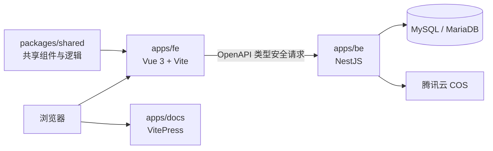

<p align="center">
  
</p>

<h1 align="center">多元记</h1>

<p align="center">
  <strong>记录生活，记录你</strong>
</p>

<p align="center">
  用一条记录容纳文字、影像、声音与文件，让离散的数据重新回到共同的时间和关系中。
</p>

<p align="center">
  <a href="https://github.com/Qubit-01/mylog3/stargazers"></a>
  <a href="https://github.com/Qubit-01/mylog3/commits"></a>
  
  
  
  
  
  
</p>

<p align="center">
  <a href="https://mylog.ink">在线体验</a>
  ·
  <a href="https://mylog.ink/docs/">使用文档</a>
  ·
  <a href="https://mylog.ink/docs/changelog">更新日志</a>
</p>

---

## 关于多元记

生活不断产生数据：一段文字、一张照片、一段声音，或者一份文件。它们格式不同、位置不同，却可能属于同一天、同一件事和同一群人。

> 数据是离散的，生活却不是。

多元记以“记录”为基本单位，把不同类型的内容放回共同的上下文中。保存只是起点；它更关心这些内容如何被组织、查询和分享，以及人在分享时如何保留自己的边界。

更完整的设计初衷见[《写在前面》](https://mylog.ink/docs/preface/)。

## 核心能力

| 能力           | 说明                                                       |
| -------------- | ---------------------------------------------------------- |
| 多元记录       | 在同一条记录中保存文字、图片、视频、音频与文件             |
| 时间组织       | 分离创建时间与记录时间，让补记回到真正发生的那一天         |
| 查询与整理     | 按可见范围、时间、正文、人员和标签筛选记录                 |
| 有边界的分享   | 支持固定分享与动态分享，也允许隐私记录只通过特定链接被看见 |
| 原始内容与预览 | 保留图片原文件，同时生成轻量预览用于日常浏览               |

## 架构



项目采用 pnpm workspace 管理。后端 DTO 是前后端数据契约的唯一来源：

```text
NestJS DTO → OpenAPI → TypeScript 类型 → openapi-fetch
```

这条生成链让接口路径、请求参数和响应结构保持一致，减少前后端分别维护类型带来的偏差。

## 技术栈

| 层级       | 技术                                               |
| ---------- | -------------------------------------------------- |
| Web        | Vue 3、Vue Router 5、Pinia 4、Element Plus、Vite 8 |
| API        | NestJS 11、Prisma 7、Swagger、Pino                 |
| 数据与存储 | MySQL / MariaDB、腾讯云 COS                        |
| 类型契约   | OpenAPI、openapi-typescript、openapi-fetch         |
| 文档       | VitePress 2                                        |
| 工程       | TypeScript 6、pnpm workspace                       |

## 项目结构

```text
mylog3/
├── apps/
│   ├── fe/          # Vue 前端应用
│   ├── be/          # NestJS API 与 Prisma 数据层
│   └── docs/        # VitePress 用户文档
├── packages/
│   └── shared/      # 跨应用共享的组件与逻辑
├── pnpm-workspace.yaml
└── README.md
```

## 本地开发

### 环境要求

- Node.js 22 或更高版本
- pnpm 10 或更高版本
- MySQL 或 MariaDB

### 获取代码

```bash
git clone https://github.com/Qubit-01/mylog3.git
cd mylog3
pnpm install
```

### 配置后端

在 `apps/be/.env` 中至少配置数据库连接与 JWT 密钥：

```dotenv
DATABASE_URL=mysql://<user>:<password>@<host>:<port>/<database>
SecretKey=<your-secret-key>
```

上传功能还需要腾讯云 COS 配置，完整字段见[后端说明](apps/be/README.md#环境变量)。

生成 Prisma Client：

```bash
pnpm --filter be exec prisma generate
```

### 启动项目

分别在三个终端中启动后端、前端与文档：

```bash
pnpm --filter be dev
```

```bash
pnpm --filter fe dev
```

```bash
pnpm --filter docs dev
```

后端默认运行在 `http://localhost:20914`，Swagger 位于 `http://localhost:20914/docs`。前端与文档地址以终端输出为准。

## 更新接口类型

修改后端 DTO 后，依次重新生成 OpenAPI 文档与前端类型：

```bash
pnpm --filter be gen:openapi
pnpm --filter fe gen:api
```

生成的 `apps/be/openapi.json` 与 `apps/fe/src/api/schema.d.ts` 都属于项目契约，需要随代码一同更新。

## 延伸阅读

- [使用文档](https://mylog.ink/docs/)
- [更新日志](https://mylog.ink/docs/changelog)
- [后端开发说明](apps/be/README.md)
- [前端开发说明](apps/fe/README.md)
